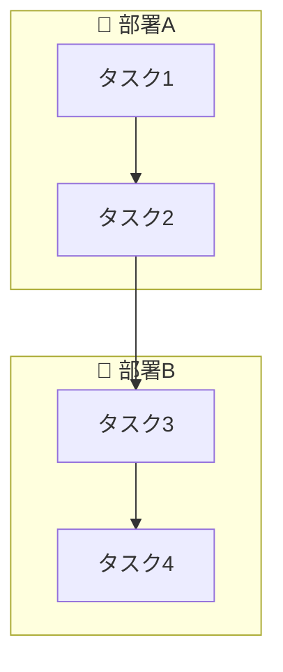
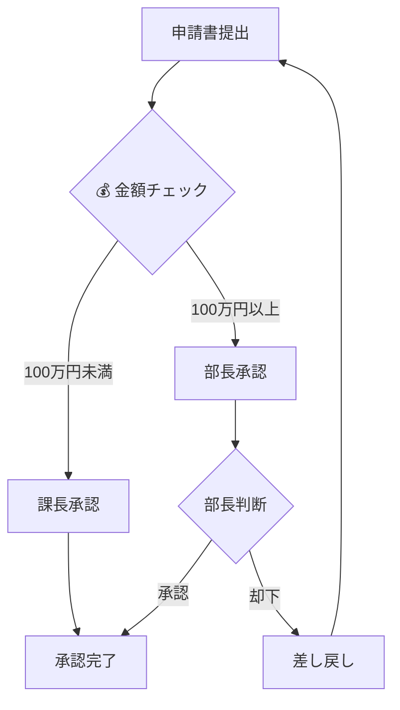
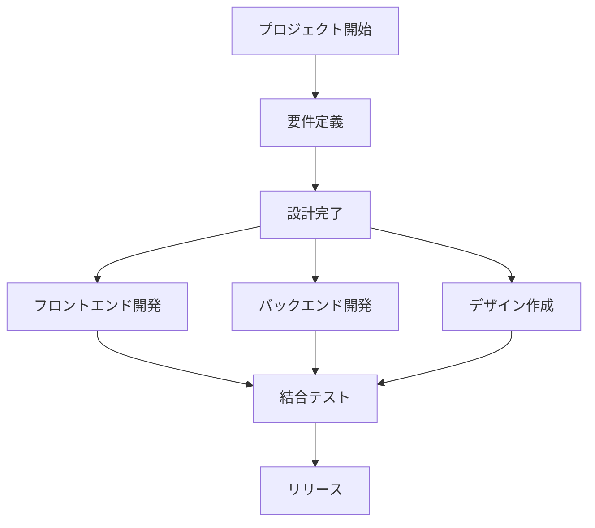
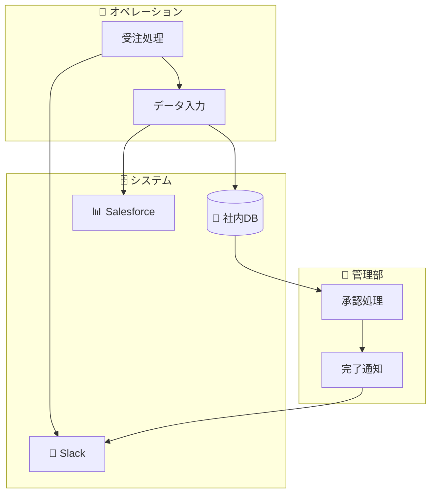
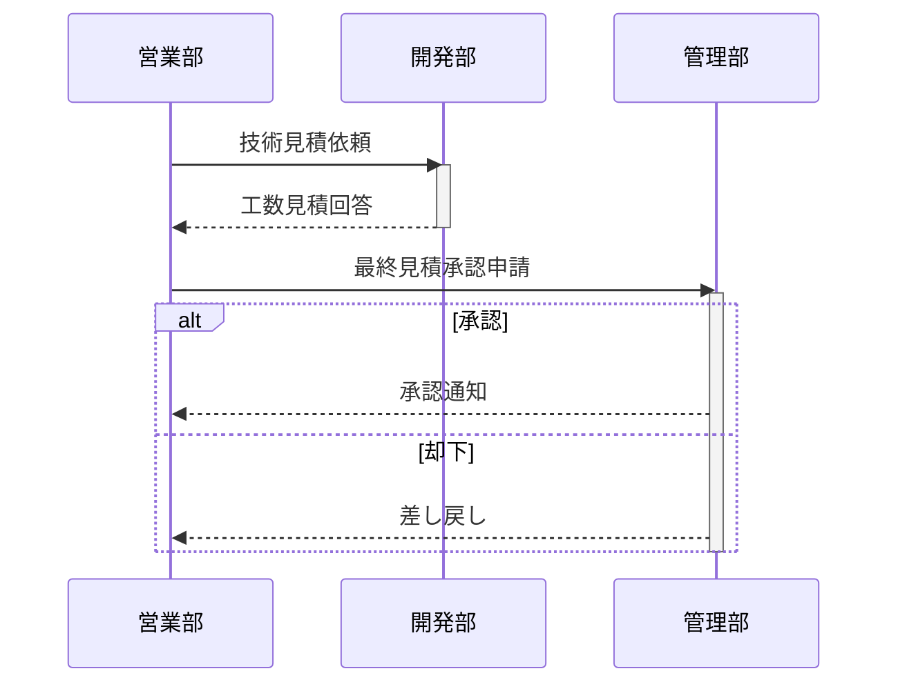
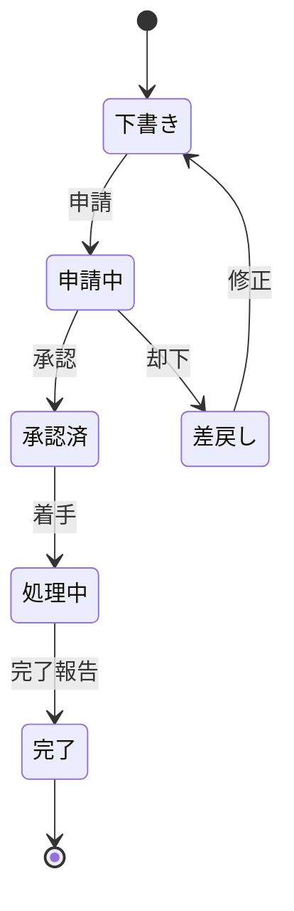
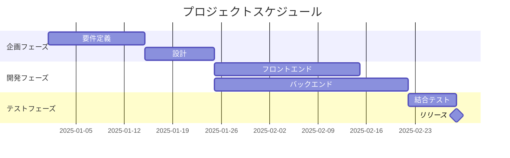

# Mermaid構文パターン集 - 業務フロー図向け

業務フロー図を生成する際のMermaid構文パターンリファレンス。
SKILL.md のStep 4で参照する。

## 1. 基本: 部署横断フローチャート

最も一般的なパターン。`subgraph` で部署をグルーピングし、部署間の連携を矢印で表現。

### ポイント
- `TD` = Top-Down（上から下）。横長にしたい場合は `LR`（Left-Right）
- subgraph のIDは英数字+アンダースコアのみ
- 表示名は `[""]` で囲む
- 部署間の接続は subgraph の外に書く

## 2. 分岐・条件分岐

承認フロー、判定ロジックなどの表現。

### ポイント
- 分岐ノードは `{}` （ひし形）
- 分岐ラベルは `-->|"ラベル"|` で記述
- 差し戻し（ループバック）も矢印で表現可能

## 3. 並行処理

複数部署が同時に作業する場合。

## 4. システム・データ連携の表現

データベース、外部サービスとの連携を含むフロー。

### ノード形状の使い分け
| 形状 | 構文 | 用途 |
|------|------|------|
| 角丸四角 | `("テキスト")` | 一般的なプロセス |
| 四角 | `["テキスト"]` | タスク・作業 |
| ひし形 | `{"テキスト"}` | 判断・分岐 |
| 円筒 | `[("テキスト")]` | データベース・ストレージ |
| 円 | `(("テキスト"))` | 開始/終了ポイント |
| 六角形 | `{{"テキスト"}}` | 外部システム・サービス |
| 台形 | `[/"テキスト"/]` | 入力 |
| 逆台形 | `[\"テキスト"\]` | 出力 |

## 5. シーケンス図（部署間コミュニケーション重視）

やり取りの順序が重要な場合はシーケンス図が適する。

### ポイント
- `participant` で登場人物（部署）を定義
- `->>` は実線矢印、`-->>` は破線矢印
- `activate/deactivate` でアクティベーションバーを表現
- `alt/else/end` で条件分岐
- `loop/end` でループ処理
- `Note over A,B: テキスト` で注釈

## 6. 状態遷移図（ステータス管理）

申請書類や案件のステータス遷移を表現。

## 7. ガントチャート（スケジュール）

プロジェクトやフェーズのタイムラインを表現。

## 8. 絵文字ガイド

業務フローで使う代表的な絵文字:

| カテゴリ | 絵文字 | 用途 |
|---------|--------|------|
| 部署 | 🏢 | 一般的な部署 |
| 部署 | 💻 | IT/開発部門 |
| 部署 | 👔 | 管理/経営部門 |
| 部署 | 📞 | カスタマーサポート |
| アクション | 📋 | 登録・記録 |
| アクション | 📝 | 作成・記入 |
| アクション | 📨 | 送信・提出 |
| アクション | 📤 | 出力・エクスポート |
| アクション | 🔧 | 設定・構築 |
| アクション | ⚙️ | 処理・実行 |
| 判断 | 🔍 | レビュー・確認 |
| 判断 | ✅ | 承認・完了 |
| 判断 | ❌ | 却下・エラー |
| システム | 💾 | データベース |
| システム | 📊 | 分析・レポート |
| システム | 💬 | チャット・通知 |
| システム | 🗄️ | ストレージ |
| フロー | ▶️ | 開始 |
| フロー | ⏹️ | 終了 |
| フロー | 🔄 | ループ・繰り返し |

## 9. 構文の注意事項

### generate_diagram で確実に動くためのルール

1. **ノードIDは英数字のみ**: `A1`, `dept_sales` はOK。`部署1` はNG
2. **"end" を小文字で使わない**: `End` や `完了` に置き換え
3. **"o" "x" で始まるノードに注意**: スペースを入れるか大文字にする
4. **引用符の統一**: `[""]` で統一する（シングルクォート混在を避ける）
5. **改行は `\n`**: ノード内で改行したい場合は `\n` を使う
6. **subgraph のネストは浅く**: 2階層まで推奨
7. **ノード数の目安**: 1ダイアグラムあたり15〜20ノード以内が見やすい

### 複雑なフローの分割指針

- 20ノード超 → フェーズ別に分割
- 3部署超 → 主要フローと詳細フローに分離
- 分岐が5つ超 → 判断フローを別図に切り出し
